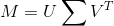
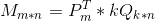
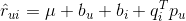
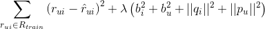
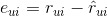
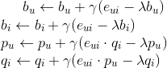
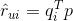

# 矩阵奇异值分解（SVD）

## Environment 
- Python 3.6 upper
- Numpy 1.4 upper

## 一、SVD（Singular Value Decomposition）
在很多情况下，数据的一小部分包含了数据的绝大部分信息，用线性代数的许多矩阵分解方法都可以将矩阵特征表现成新的易于理解的形式，在这一过程之中，实际是一个提取数据集合特征值的过程（降噪），有利于我们提高算法的精准度，减少数据运算量。
最常见的矩阵分解算法就是矩阵奇异值分解（SVD），SVD 在图像压缩、推荐系统、金融数学等领域都有应用，著名的主成成分分析算法（PCA）也是通过 SVD 实现的。

## 二、SVD 理论简介
假设 M 是一个 m*n 阶的样本矩阵，其中的元素全部属于域 K，那么矩阵分解可得：
 
 

 
 
也可以描述成： U（m*m），sigma（m*n），VT（n*n）

矩阵 sigma 除了对角元素不为0以外，其他元素都为0，并且对角元素是从大到小顺序排列的，这些对角元素就是奇异值。
所以。对于任意的奇异值分解，矩阵 sigma 的对角线上的元素等于M的奇异值。U和V的列分别是奇异值中的左奇异向量和右奇异向量。

##  三、SVD 图像降噪
这是一个图像化说明 svd 的例子，虽然有一些意义不明。
 

 

 
保留的奇异值越多，图片的特征保留的越明显，当奇异值减少时，图片中的像素间的差距逐渐减小（表现的模糊）。

## 五、Funk SVD 算法
这个著名的 SVD 算法是基于2006年 Netflix Prize 中 Simon Funk 在博客公开的算法。被称为（Funk-SVD）。
简单的来说就是将原本的 SVD 的思想上加上了线性回归，也就是说，我们可以用均方差作为损失函数，来寻找 P 和 q 的最终值，线性回归和均方差对于机器学习的同学们来说一定不陌生了，如果你还没有了解过，可能一下子理解不了下面的公式，那么我建议还是先从线性回归学起，便于理解。不过，线性回归也就是一句话 —— 线性函数参数调优。
符号含义：
- \gamma  rates 学习率
- \lambda  regularization 正则化项
- b biased 偏移

矩阵 M 经过Funk SVD 分解之后：
 
 

 
 
对于某一个用户的评分使用 Funk SVD 进行矩阵分解得到的结果就是：
 
 

 
 
那么我们需要最小化的损失函数就是：
 
 

 
 
损失就是：
 
 

 
 
使用随机梯度下降调参：
 
 

 
 
还有一种情况就是，抛弃biased，也就是：
 
 

 
 
这就相当于是概率矩阵分解。

文章链接：[推荐算法入门（2）SVD篇](https://zhuanlan.zhihu.com/p/33262521)

